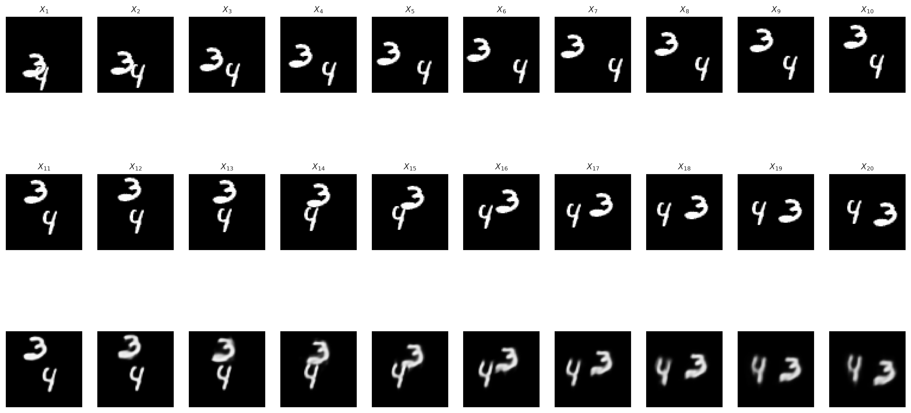

# SRVP: Strong Recollection Video Prediction Model Using Attention-Based Spatiotemporal Correlation Fusion
This is a Pytorch implementation of SRVP. We provide an example using `Moving MNIST` in this repository.

## Datasets
For this example, 'mnist_test_seq.npy' should be in `datasets/`.  You can get 'mnist_test_seq.npy' from [Srivastava](https://www.cs.toronto.edu/~nitish/unsupervised_video/).  

## Environment
* GPU: NVIDIA RTX A6000 (50GB)
* CUDA 12.4
* Python 3.8
* Pytorch 2.4.1+cu124
* We recommend using `Miniconda` to set up the virtual environment for training SRVP.
* Install
```
conda create -n srvp python=3.8
conda activate srvp
pip install -r requirment.txt
```

## Training
* Set up the hyper-parameters in `train.sh`
```
ctx=0
epoch=150
bs=8
lr=1e-5
hidden=128
layer=4
mode=train

python main.py --mode=$mode --ctx=$ctx --bs=$bs --epoch=$epoch --lr=$lr --hidden=$hidden --layer=$layer
```
* Then, run the script file:
```
bash train.sh
```
* The trained model, check point files, and a log file will be generated in `results/mnist`. 

## Inference
* After training, copy `train.sh` to `inference.sh`, and revise `mode=train` to `mode=test`.
```
bash inference.sh
```
* The prediction results and evaluation metrics will be presented in `results/mnist`. An example of the predicted frames:

<p align="center">
     <br>
</p>

* If you want to get the other sample, change the value of `idx` in `main.py`. Then, run the `inference.sh`.

## Citation
It will be released.
